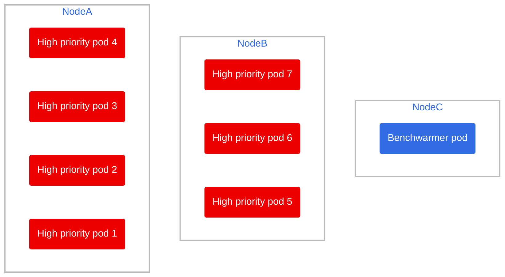

# Benchwarmer pod

This repository was created with the goal of showcasing some scenarios where we need to have a spare node ready to take on a sudden increase in cluster load, avoiding downtime due to cloud provisioning. Keep in mind this could also be done with an operator.

## What you need

Of all the files in this repository, the only actual files you need to replicate this result are:

- The [Low priority definition](./setup/low-priority-definition.yaml): used by the benchwarming pods to have a lower than default average, allowing the scheduler to evict them in lieu of the actual workload.
- The [Benchwarmer deployment](./setup/benchwarmer-deployment.yaml), the actual pod/pods that will serve to fill up empty nodes until an actual workload comes along

## Assumptions

To demo's sake, we will assume the following:

- Cluster has node autoscaling from 2 to 5 nodes
- Nodes have 12GB of RAM each
- All pods **request** 2GB of RAM

## Setup

Head over to the [🔗 setup](./setup/) folder and create all the resources in the `.yaml` files.

You should end up with 2 nodes, one filled with 3 high priority pods and the other with a single benchwarming pod.

## Scenario 1: Scaling up, needing a new node

[🔗 Link](./scenario1.md)

4 new high priority pods arrive, and there are not enough resources to accomodate them and the previous 3 high priority pods.

## Scenario 2: Scaling up massively, needing 2 spare nodes

[🔗 Link](./scenario2.md)

8 new high priority pods arrive, and there are not enough resources to accomodate them and the previous 3 high priority pods.
