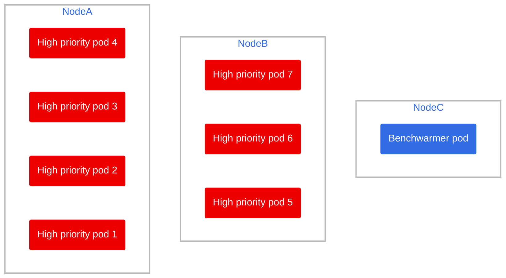

# Benchwarmer pod

This repository was created with the goal of showcasing some scenarios where we need to have a set of spare nodes ready on a namespace to take on a sudden increase in cluster load, avoiding downtime due to cloud provisioning. Keep in mind this could also be done with an operator.

> Note: this solution is meant to work on a specific namespace, not cluster wide unless you manually exclude all k8s/openshift level namespaces.

- [Benchwarmer pod](#benchwarmer-pod)
  - [Preview](#preview)
  - [How many availability zones do you have?](#how-many-availability-zones-do-you-have)
  - [What you need](#what-you-need)
  - [Assumptions](#assumptions)
  - [Setup](#setup)
  - [Scenarios](#scenarios)
    - [Scenario 1: Scaling up, needing a new node](#scenario-1-scaling-up-needing-a-new-node)
    - [Scenario 2: Scaling up massively, needing 2 spare nodes](#scenario-2-scaling-up-massively-needing-2-spare-nodes)

## Preview

## How many availability zones do you have?

If you have one, or want to run a quick test, head over to the setup folder and [readme](./setup/README.md). If you need a multi-AZ setup, the `multiZoneSetup` folder and [readme](./multiZoneSetup/README.md) are your friends.

## What you need

Of all the files in this repository, the only actual files you need to replicate this result are:

- The Low priority definition: used by the benchwarming pods to have a lower than default priority, allowing the scheduler to evict them in lieu of the actual workload.
- The Benchwarmer deployment: the actual pod/pods that will serve to fill up empty nodes until an actual workload comes along

## Assumptions

To demo's sake, we will assume the following:

- Cluster has node autoscaling from 2 to 5 nodes
- Nodes have 12GB of RAM each
- All pods **request** 2GB of RAM

## Setup

Head over to the corresponding setup folder:

- [🔗 Single availability zone setup](./setup/)
- [🔗 Multiple availability zone setup](./multiZoneSetup/)

and create all the resources in the `.yaml` files.

## Scenarios

These are some sample scenarios to clarify and explain how this works step by step. Please bear in mind the scenario and commands are for the single AZ setup (to not overcomplicate the graphs), but multi AZ will work the same.

### Scenario 1: Scaling up, needing a new node

[🔗 Link](./scenario1.md)

4 new high priority pods arrive, and there are not enough resources to accomodate them and the previous 3 high priority pods.

### Scenario 2: Scaling up massively, needing 2 spare nodes

[🔗 Link](./scenario2.md)

8 new high priority pods arrive, and there are not enough resources to accomodate them and the previous 3 high priority pods.
