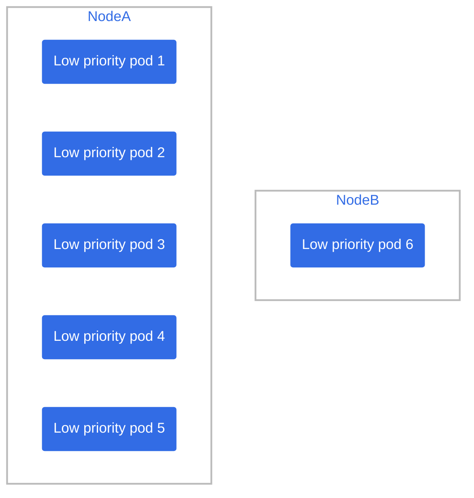
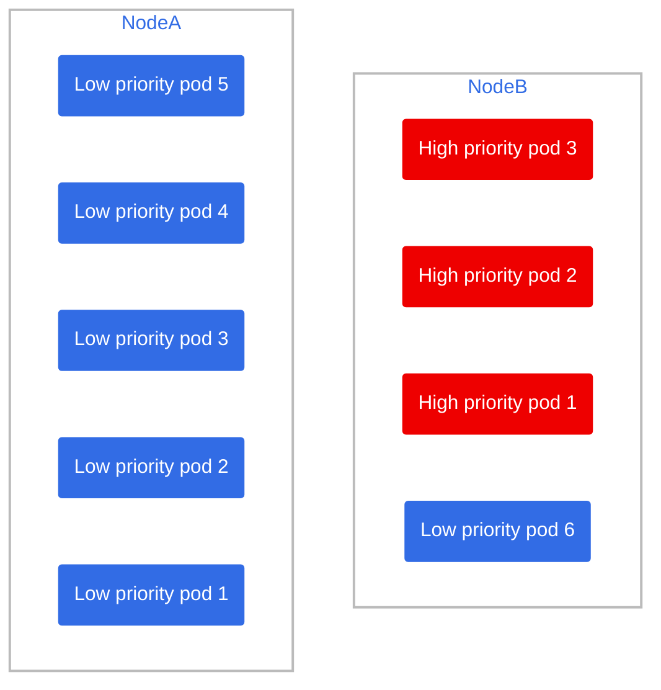
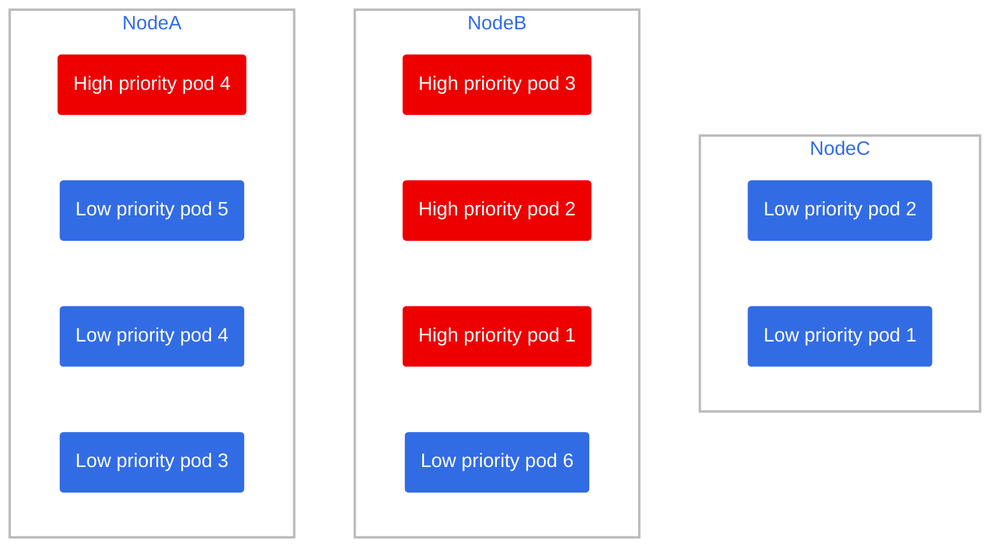

# pod-scale-test

## Scenario 1

if we now add 3 high priority nodes, they'd be pushed to node B since there are available resources for them.

however if we add a 4th high priority node, it won't fit in any of the two nodes, so:

1) One node will open up space for the new pod (let's say Node A) by evicting two low priority pods and marking them as pending.
2) The new, 4th high priority node will be deployed
3) Since we have node autoscaling, a new node will be provisioned for the 2 pending low priority pods
4) After a few minutes, Node C is ready and the pending pods are assigned to it.

So virtually there was no downtime on high priority nodes.
