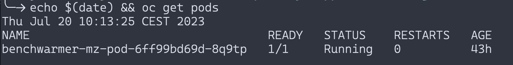
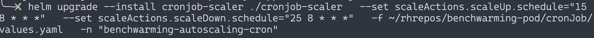
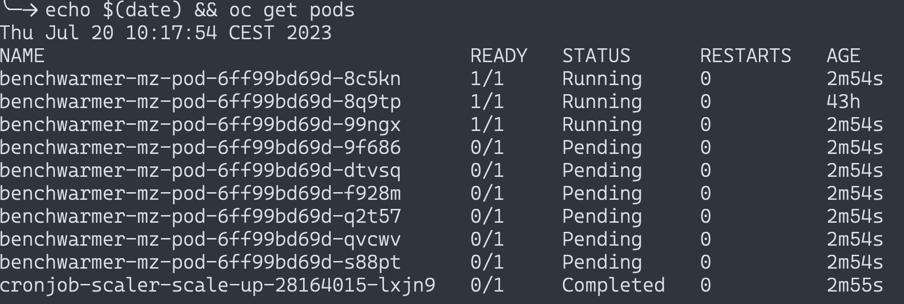
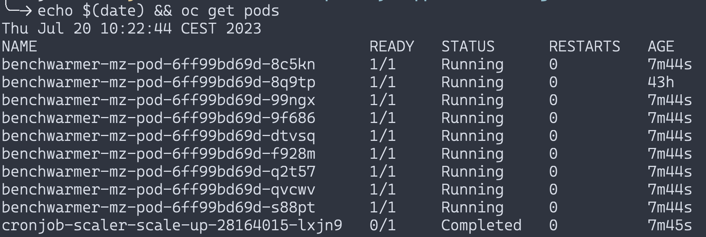
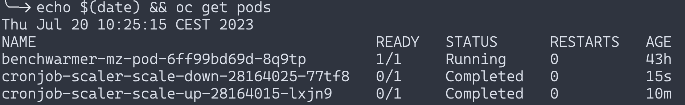

# Scaling deployments with cron jobs

Say you have a deployment running, but you notice that there is not that much demand for it at night, so you decide you will scale down de number of replicas every day at 21:00 to save some money and scale up at 08:00 so you can sustain higher bursts in pod usage.

There are many ways to accomplish this, some more sophisticated than others, but a very simple method is just to use cron jobs.

These jobs will be run on the specified periocity, either hour based (for example at 08:00 every day) or by ellapsed time (every 2 minutes).

## Sources

To get a more detailed explanation on the process and other alternatives on how to set similar setups, head over to [this](https://cloud.redhat.com/blog/3-methods-of-auto-scaling-openshift-applications) Red Hat blog post. We will be using Method 1.

## Setup

Like the other projects, we will create a separate project to keep our assets under control via

```bash
cd cronJob
oc apply -f project-request.yaml
oc project benchwarming-autoscaling-cron
```

Let's create some sample workloads.

```bash
oc apply -f low-priority-mz-definition.yaml
oc apply -f benchwarmer-mz-deployment.yaml
```

Now that we have some pods running, let's scale via cron.

### 1) Clone helm

```bash
git clone https://github.com/CSA-RH/rhocp-3-ways-apps-autoscaling.git
cd rhocp-3-ways-apps-autoscaling
```

and run the helm chart

```bash
helm upgrade --install cronjob-scaler ./cronjob-scaler \
  --set scaleActions.scaleUp.schedule="13 9 * * *" \
  --set scaleActions.scaleDown.schedule="19 9 * * *" \
  -f ~/<benchwarming-pod-repository>/cronJob/values.yaml \
  -n "benchwarming-autoscaling-cron"
```

and change the time (in UTC) accordingly.

## Demo

Before starting, we have a single pod running



Then we run the command to scale on specific times (10:15/10:25 respectively in our timezone)



After the scale up date comes, the pods start spinning up



and it will eventually deploy fully after the required nodes spin up.



Now we wait for it to spin down when the cron date comes



## Uninstall

Simple! just run

```bash
helm uninstall cronjob-scaler || true
```
