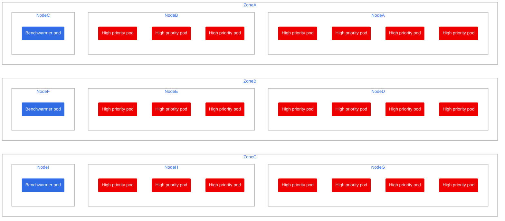
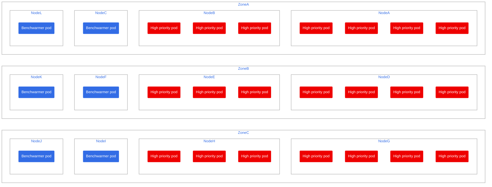

# Multi zone setup

This works much like the single-zone setup but on multiple AZs! that means that if you have 3 AZ in your cluster, one benchwarming pod will keep one benchwarming node per AZ

To get it up and running:

- [Multi zone setup](#multi-zone-setup)
	- [Setup](#setup)
		- [1) Create the project and change to it](#1-create-the-project-and-change-to-it)
		- [2) Ensure your machinepool on `rosa` is set to autoscale](#2-ensure-your-machinepool-on-rosa-is-set-to-autoscale)
		- [2) Create the benchwarming pod](#2-create-the-benchwarming-pod)
		- [3) Create the high-priority deployment](#3-create-the-high-priority-deployment)
	- [What it looks like](#what-it-looks-like)
		- [Example 1: One spare node per AZ](#example-1-one-spare-node-per-az)
		- [Example 2: Two+ spare node per AZ](#example-2-two-spare-node-per-az)
	- [Note on downscaling](#note-on-downscaling)

## Setup

### 1) Create the project and change to it

Let's do our testing in a separate namespace

```bash
oc apply -f project-request-mz.yaml
oc project benchwarming-multizone-autoscaling
```

### 2) Ensure your machinepool on `rosa` is set to autoscale

```bash
rosa login
rosa list machinepool --cluster=<myClusterId>
```

If it's not set to autoscale, you can do it like so, let's set it from 3 to 6 nodes.

```bash
rosa edit machinepool --enable-autoscaling --min-replicas=3 --max-replicas=6 --cluster=<myClusterId> <myMachinePoolId>
```

### 2) Create the benchwarming pod

It's been created as a deployment in case you want to play around with scaling, but it only runs a single pod unless specified in a scenario

```bash
oc apply -f benchwarmer-mz-deployment.yaml
```

### 3) Create the high-priority deployment

```bash
oc apply -f high-priority-mz-deployment.yaml
```

it's set to 3 replicas by default.

## What it looks like

Assuming 3 AZs

### Example 1: One spare node per AZ

Set replicas to 3

```bash
oc scale deployment benchwarmer-mz-pod --replicas=3
```



### Example 2: Two+ spare node per AZ

Set replicas to 6 or any other multiple of 3

```bash
oc scale deployment benchwarmer-mz-pod --replicas=6
```



It also works with non multiples of 3, in case you need to have a very granular approach to this.

## Note on downscaling

There is a limitation on the topology constraints from the kubernetes implementation:

> There's no guarantee that the constraints remain satisfied when Pods are removed. For example, scaling down a Deployment may result in imbalanced Pods distribution

So if you downscale from 12 to 3 pods with 3 AZ, you might end up with two on AZ-1 and one in AZ-3. Three nodes as expected, but on uneven AZs.

In practice, and for this case, it's not going to be a problem, but good to keep in mind nonetheless.

If you still want to adress it (no need, honestly), [🔗 here](https://kubernetes.io/docs/concepts/scheduling-eviction/topology-spread-constraints/#known-limitations) are the official docs and references.

A quick solution would be to scale the deployment to 0 pods and immediately back to the desired number of pods. Those would be evenly distributed as expected.
