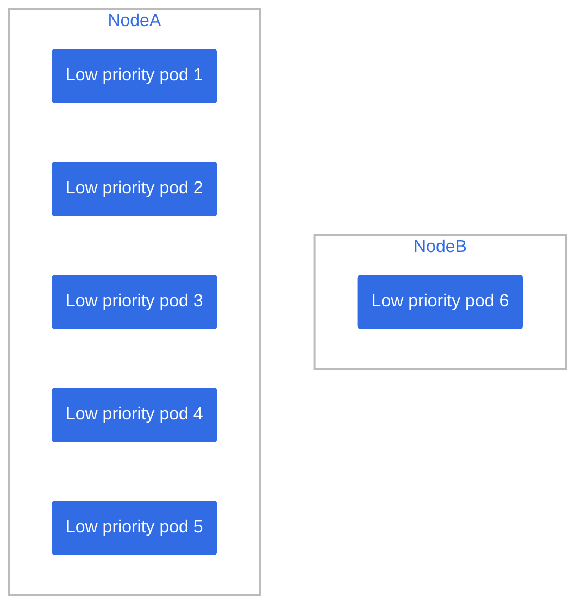
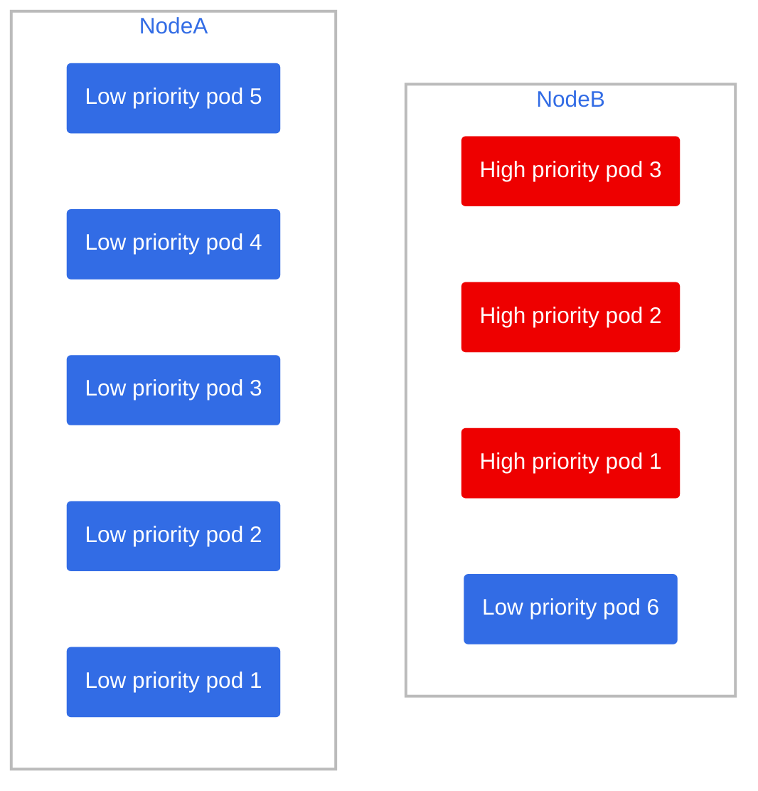
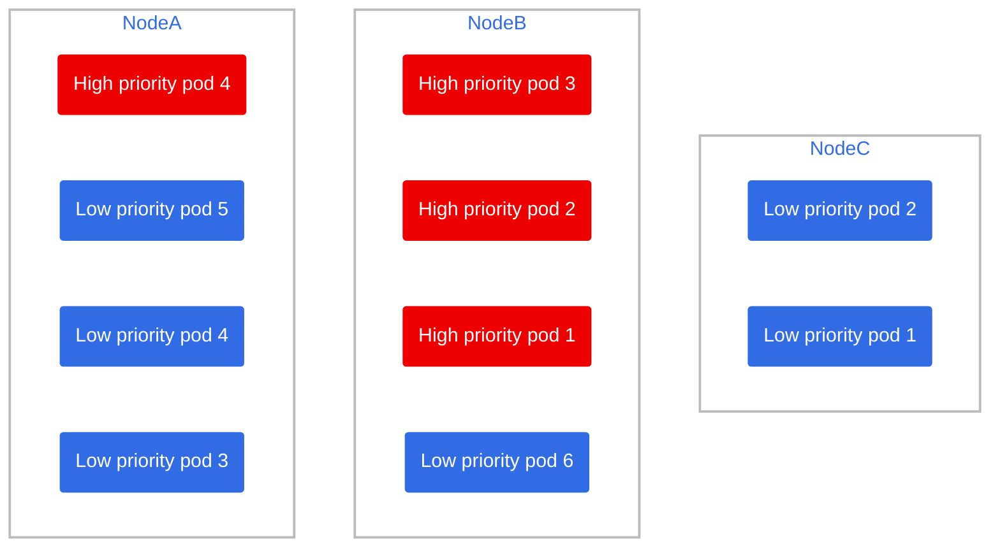

# Scenario 1: Scaling up, needing a new node

4 new high availability pods arrive, and there are not enough resources to accomodate them and the previous 6 low priority nodes.

## Cleanup (if you have done other scenarios before)

Delete old pods from other scenarios

```bash
oc delete deployment benchwarmer
oc delete deployment high-priority-pod
```

> ⚠️ Wait for pods to be terminated and make let the node autoscaler do its work dialing the nodes back to 2!

Run the deployments again

```bash
oc apply -f benchwarmer.yaml
oc apply -f high-priority-pod.yaml
```

## Setup

This is the current state of the cluster



Let's add 3 more high priority nodes:

```bash
oc scale --replicas=3 deployment high-priority-pod
```

> 🕣 **Time taken**: instantaneous

they're be pushed to node B since there are available resources for them.



however if we add a 4th high priority node via:

```bash
oc scale --replicas=4 deployment high-priority-pod
```

it won't fit in any of the two nodes, so:

1) One node will open up space for the new pod (let's say Node A) by evicting two low priority pods and marking them as pending.

   > 🕣 **Time taken**: instantaneous

    ```mermaid
    graph TB
    subgraph NodeB
        hp3(High priority pod 3)
        hp2(High priority pod 2)
        hp1(High priority pod 1)
        lp6(Low priority pod 6)
    end
    subgraph NodeA
        hp4(High priority pod 4)
        lp5(Low priority pod 5)
        lp4(Low priority pod 4)
        lp3(Low priority pod 3)
    end
    
    classDef plain fill:#ddd,stroke:#fff,stroke-width:4px,color:#000;
    classDef lowprio fill:#326ce5,stroke:#fff,stroke-width:4px,color:#fff;
    classDef highprio fill:#ee0000,stroke:#fff,stroke-width:4px,color:#fff;
    classDef cluster fill:#fff,stroke:#bbb,stroke-width:2px,color:#326ce5;
    class hp1,hp2,hp3,hp4,hp5,hp6,hp7,hp8,hp9 highprio;
    class lp1,lp2,lp3,lp4,lp5,lp6,lp7,lp8,lp9 lowprio;
    class NodeA,NodeB,NodeC cluster;
    ```

   ```mermaid
    graph TB
    subgraph Pending to be scheduled
        lp10(High priority pod 2)
        lp9(High priority pod 1)
        lp10 ~~~ lp9
    end

    classDef lowprio fill:#1111a5,stroke:#fff,stroke-width:4px,color:#fff;
    classDef cluster fill:#fff,stroke:#bbb,stroke-width:2px,color:#326ce5;
    class lp9,lp10 lowprio;
    ```

2) The new, 4th high priority node will be deployed

   > 🕣 **Time taken**: instantaneous

3) Since we have node autoscaling, a new node will be provisioned for the 2 pending low priority pods

   > 🕣 **Time taken**: 7-15 minutes

4) After a few minutes, Node C is ready and the pending pods are assigned to it.



So virtually there was no downtime on high priority pods.
