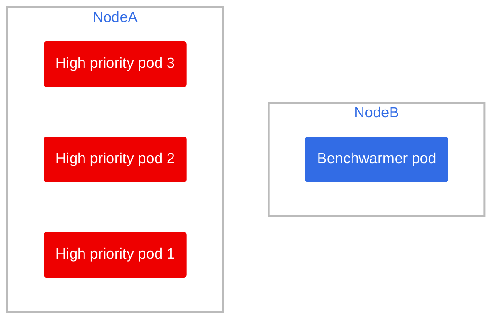
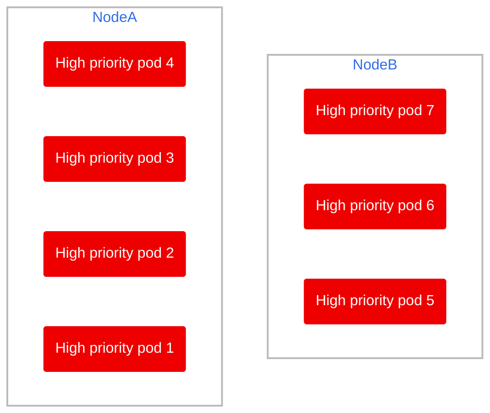
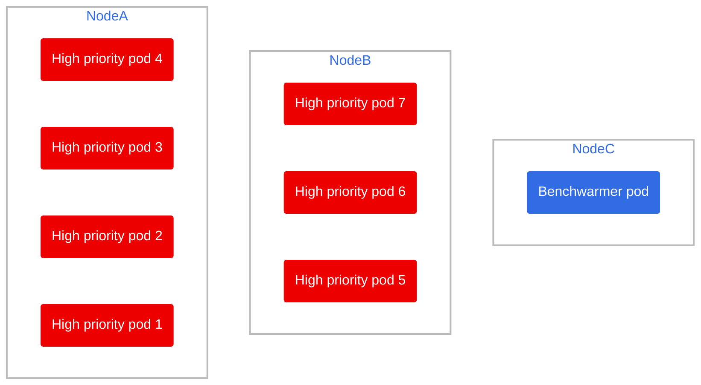

# Scenario 1: Scaling up, needing a new node

4 new high priority pods arrive, and there are not enough resources to accomodate them and the previous 3 high priority pods.

## 🧹 Cleanup (if you have done other scenarios before)

Delete old pods from other scenarios

```bash
oc delete deployment benchwarmer
oc delete deployment high-priority-pod
```

> ⚠️ Wait for pods to be terminated and make let the node autoscaler do its work dialing the nodes back to 2!

Run the deployments again

```bash
oc apply -f benchwarmer.yaml
oc apply -f high-priority-deployment.yaml
```

## 📝 Setup

This is the current state of the cluster



Let's add 4 more high priority nodes:

```bash
oc scale --replicas=7 deployment high-priority-pod
```
> 🕣 **Time taken**: instantaneous

Here is what will happen:

1) The 4 pods will be scheduled to be deployed
    > 🕣 **Time taken**: instantaneous
2) The scheduler will try to evenly distribute the load between the nodes, there is plenty of room in Node B and a little on Node A, so it will spread them accordingly.
    > 🕣 **Time taken**: instantaneous
3) Node B has the benchwarming pod, which has an antiaffinity rule so it cannot be in a node with anything but its own type of pod, so it will be evicted when the high priority pods arrive (since they have `priorityClassName: high-priority` within their spec)
    > 🕣 **Time taken**: instantaneous




1) A pending pod tells the node autoscaler to provision a new node for it.
    > 🕣 **Time taken**: 7 minutes

## ✅ Final result

Despite the cloud provider requiring around 7 minutes to provision a new node, we had 0 high priority pod downtime thanks to the "spare" node kept around by the benchwarming pod


