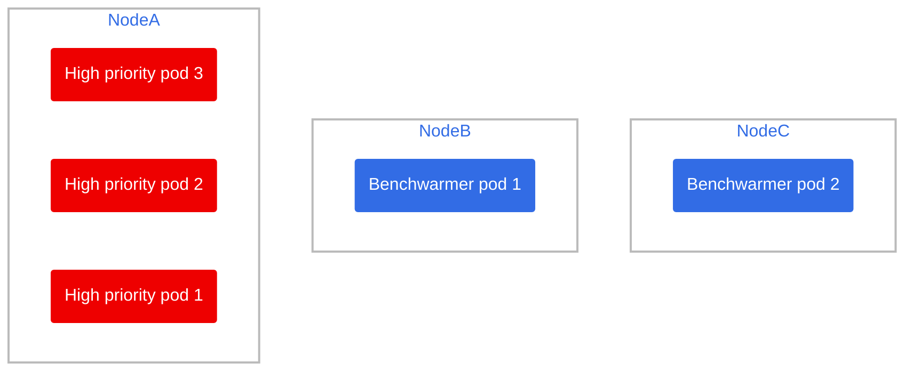
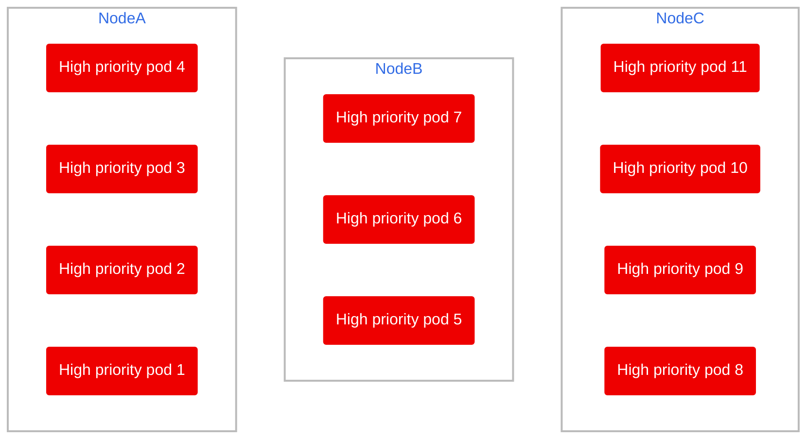
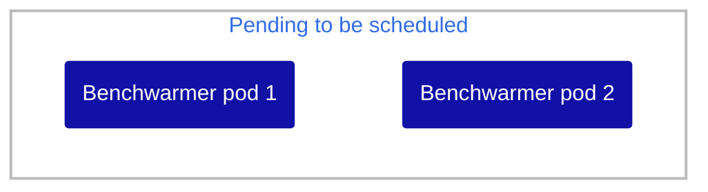
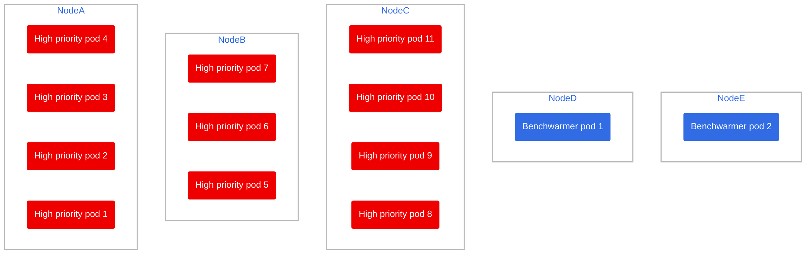

# Scenario 2: Scaling up massively, needing 2 spare nodes

8 new high priority pods arrive, and there are not enough resources to accomodate them and the previous 3 high priority pods.

## 🧹 Cleanup (if you have done other scenarios before)

Delete old pods from other scenarios

```bash
oc delete deployment benchwarmer
oc delete deployment high-priority-pod
```

> ⚠️ Wait for pods to be terminated and make let the node autoscaler do its work dialing the nodes back to 2!

Run the deployments again

```bash
oc apply -f benchwarmer.yaml
oc apply -f high-priority-deployment.yaml
```

## 📝 Setup

First of all, since we know that we will have sudden bursts of pods, which a single spare node might not be able to accomodate, we will add a second spare node

```bash
oc scale --replicas=2 deployment benchwarmer-pod
```

> 🕣 **Time taken**: 5 minutes

This is the current state of the cluster



Let's add 8 more high priority nodes:

```bash
oc scale --replicas=11 deployment high-priority-pod
```

Here is what will happen:

1) The 8 new pods will be scheduled to be deployed
    > 🕣 **Time taken**: instantaneous
2) The scheduler will try to evenly distribute the load between the nodes, there is plenty of room in Node B and C, and a little on Node A, so it will spread them accordingly.
    > 🕣 **Time taken**: instantaneous
3) Node B and C has benchwarming pods 1 and 2 respectively, which have an set of antiaffinity rules so they cannot be in a node with anything else, thus it will be evicted when the high priority pods arrive (since benchwarmer pods have `priorityClassName: low-priority` within their spec)
    > 🕣 **Time taken**: instantaneous





1) Two pending pods tell the node autoscaler to provision a new node for each.
    > 🕣 **Time taken**: 5 minutes

## ✅ Final result

Despite the cloud provider requiring around 5 minutes to provision two new node2, we had 0 high priority pod downtime thanks to the "spare" nodes kept around by the benchwarming pod


