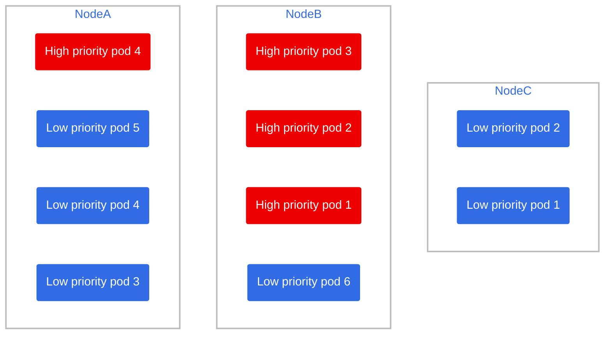
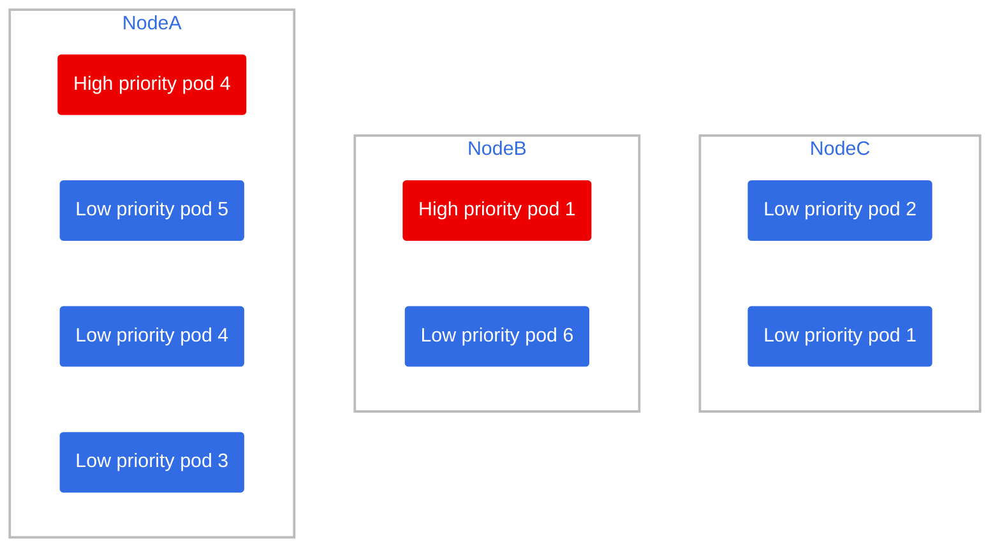
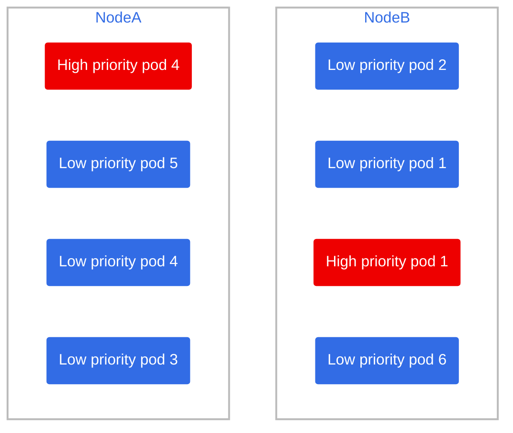

# Scenario 2

We start from [🔗 Scenario 1](./scenario1.md), but de-scaling back: What if we delete half the high priority load?

## Cleanup

If you have done scenario 1, skip this step, if not then clean it up via:

Delete old pods from other scenarios

```bash
oc delete deployment low-priority-pod
oc delete deployment high-priority-pod
```

Run the deployments again

```bash
oc apply -f low-priority-pod.yaml
oc apply -f high-priority-pod.yaml
```

scale low priority pods

```bash
oc scale --replicas=4 deployment high-priority-pod
```

## Setup

This is the current state of the cluster



Let's scale from 4 high priority replicas down to 2

```bash
oc scale --replicas=2 deployment high-priority-pod
```

> 🕣 **Time taken**: instantaneous



Now we wait for the node autoscaler to do its job and move the pods around the nodes to save resources, downscaling our node list from 3 to 2

> 🕣 **Time taken**: 10 minutes

leaving the cluster like this:


