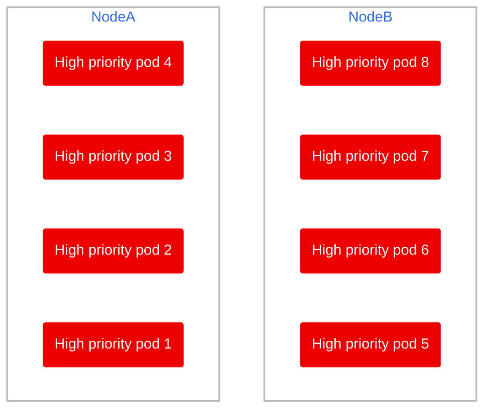
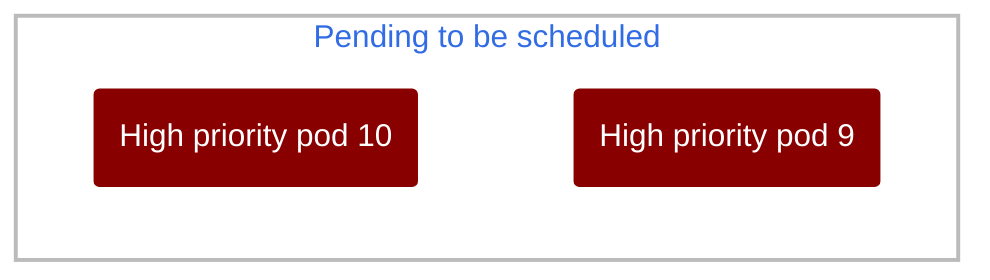
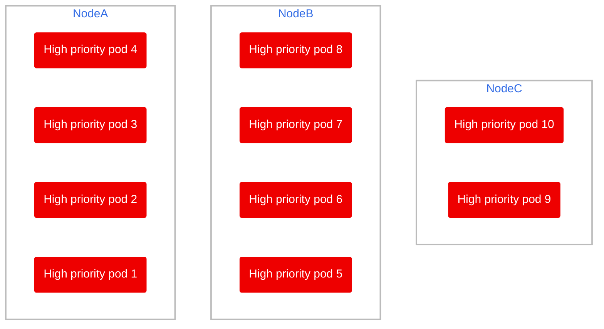

# Scenario 3

Let's assume we have high priority pods filling up 2 nodes and no low priority pods. What would happen if we add a new high priority pod?

## Cleanup

Delete old pods from other scenarios

```bash
oc delete deployment low-priority-pod
oc delete deployment high-priority-pod
```

Run the high priority deployment again

```bash
oc apply -f high-priority-pod.yaml
```

## Setup

There should be no pods in the namespace, let's create some high priority ones!

```bash
oc scale --replicas=8 deployment high-priority-pod
```

> 🕣 **Time taken**: instantaneous

This is the current state of the cluster afterwards



Let's scale from 8 high priority replicas up to 10

```bash
oc scale --replicas=10 deployment high-priority-pod
```

But there is no space left in the 2 nodes, so:

1) The scheduler has no place to deploy the pods, so they're set as pending

    > 🕣 **Time taken**: instantaneous

2) The node autoscaler kicks in and spawns a new node

    > 🕣 **Time taken**: 7-15 minutes

3) The scheduler adds the pending pods

    > 🕣 **Time taken**: instantaneous

So it'll go from this:




To this:



So there is a downtime for high priority pods since it's the only load and the scheduler cannot evict any low priority pods inmediately to replace them.

In this case we can't do anything but wait for the node autoscaler to kick in.
