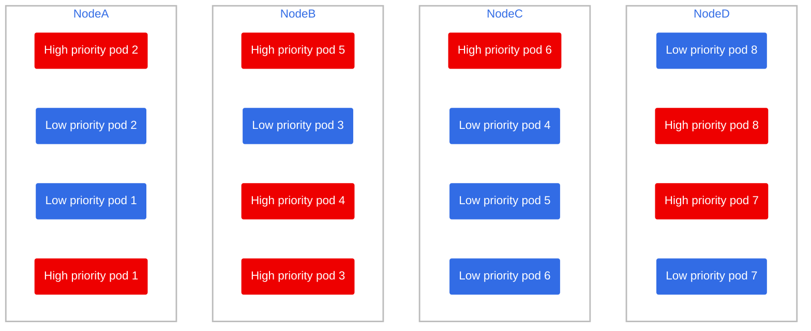
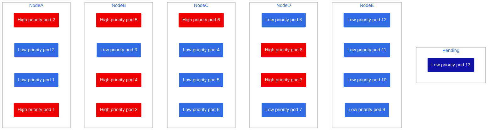
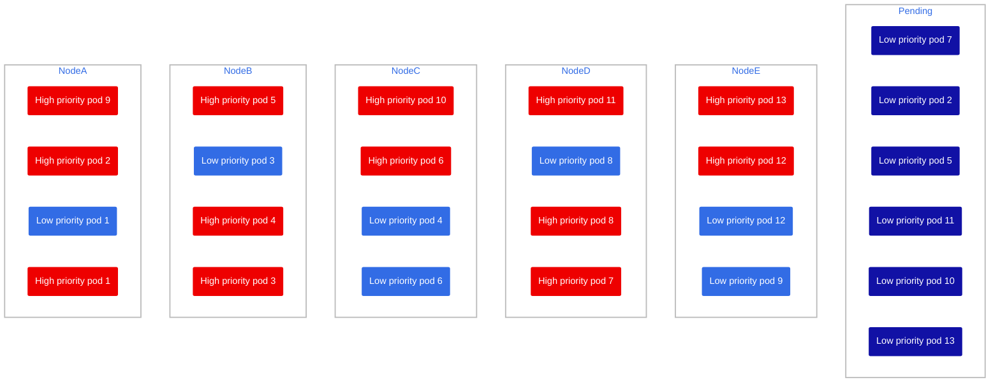

# Scenario 4: Overflow

We have 4 nodes up and running with an even load of both high and low priority pods. What happens if we overload the cluster, reaching the node autoscaler max count? We currently have our node autoscaler from 2 nodes to 5 nodes.

## Cleanup

Delete old pods from other scenarios

```bash
oc delete deployment benchwarmer
oc delete deployment high-priority-pod
```

Run the deployments again

```bash
oc apply -f benchwarmer.yaml
oc apply -f high-priority-pod.yaml
```

## Setup

Let's fill the cluster up!

```bash
oc scale --replicas=8 deployment benchwarmer
oc scale --replicas=8 deployment high-priority-pod
```

This is the current state of the cluster afterwards



Great! Although we are pretty close to the 5 node maximum limit!

Let's add 3 more low priority pods

```bash
oc scale --replicas=13 deployment benchwarmer
```

> 🕣 **Time taken**: 6 minutes

Our setup now looks like this



Not an ideal scenario, but the only pod pending is a low priority, and all high priority pods are up and running.

What if we hit it with a high priority pod load? maybe 3 more pods

```bash
oc scale --replicas=13 deployment benchwarmer
```

> 🕣 **Time taken**: instantaneous (no new nodes can be created)

Since there is a pod pending, you'd think it'd get scheduled first, before the new payload. However the `PriorityClass` makes the scheduler prioritize the new pods

