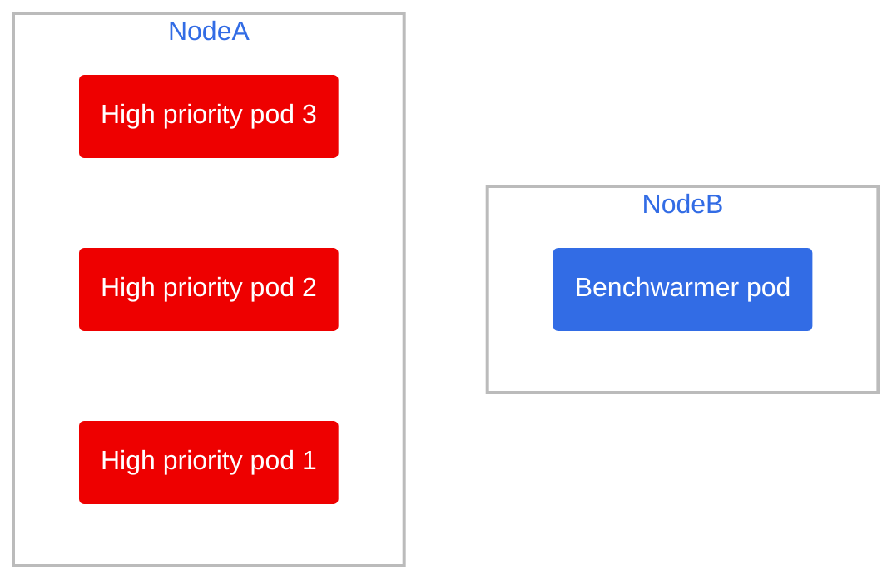

# Phase 1

The main goal is to have a low priority, best-effort deployment that takes up 90% of the resources of a pod, then run a high priority, high QoS Guaranteed deployment and see how the low priority nodes are evicted.

## Steps

### 1) Create the project and change to it

Let's do our testing in a separate namespace

```bash
oc apply -f project-request.yaml
oc project benchwarming-autoscaling
```

### 2) Ensure your machinepool on `rosa` is set to autoscale

```bash
rosa login
rosa list machinepool --cluster=<myClusterId>
```

If it's not set to autoscale, you can do it like so, let's set it from 2 to 5 nodes.

```bash
rosa edit machinepool --enable-autoscaling --min-replicas=2 --max-replicas=5 --cluster=<myClusterId> <myMachinePoolId>
```

### 2) Create the benchwarming pod

It's been created as a deployment in case you want to play around with scaling, but it only runs a single pod unless specified in a scenario

```bash
oc apply -f benchwarmer-deployment.yaml
```

### 3) Create the high-priority deployment

```bash
oc apply -f high-priority-deployment.yaml
```

it's set to 3 replicas by default.

### 4) Head over to the scenarios and try them

## Initial setup


